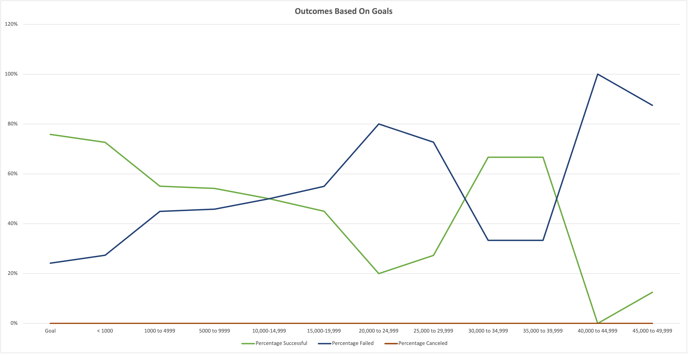

# Kickstarting with Excel

## Overview of Project

### Purpose

The purpose of this analysis is to determine how the success of a kickstarter fundraiser relates to the timing and the goal of the fundraiser. This information will be used to help a friend, Louise, launch a successful fundraiser on Kickstarter for her play, *Fever*.

## Analysis and Challenges

### Analysis of Outcomes based on Launch Date

Working with a dataset that includes kickstarter fundraising data over a period of 8 years, I first added columns and refined the data for better analysis, Then, I created a pivot table to summarize fundraiser outcomes based on launch date. 

Filtering this table by the Parent Category “theater” I was able to visualize campaign outcomes (successful, failed, or canceled) for all Theater fundraisers based on launch date. 

### Analysis of Outcomes Based on Goals

Next, I analyzed the success of the campaigns based on the fundraising goal. To do so, I used the COUNTIF() function to count the number of instances of a successful, failed, or canceled fundraiser within various goal ranges, and in the subcategory of “Plays” which is the subcategory of my friend Louise’s fundraiser.

I visualized this data as a percentage of successful, failed, and canceled campaigns so it’s easier to grasp which fundraiser goal ranges are more likely to be successful than not. 

### Challenges and Difficulties Encountered

No major challenges were encountered when analyzing this data. Possible challenges and difficulties could be properly formatting and filtering data for the pivot tables, properly visualizing the data, and manipulating an excel sheet with several thousand rows of data without error.

## Results

### Results for Theater Outcomes by Launch Date

From the Theater Outcomes by Launch Date, posted again below for convenience, we can see that the most successful fundraisers for the Theater category were launched in the month of May, with June and July having more successful outcomes than any other month. On the other hand, the number of failed campaigns were more or less steady throughout the year with May through August having roughly the same number of failed campaigns launched. 

### Results for Outcomes based on Goals

From the Outcomes based on Goals, again posted once more below for your convenience, you can see that the fundraisers with a goal of less than or equal to $14,999 and those between $35,000-$44,999 are more likely to be successful than to have a failure of an outcome.

### Limitations of the Dataset

One limitation of this data is that it does not include individual donation amounts, nor minimum and maximum donations. While we do know the amount raised and the number of backers, having the additional information of the range of donations could be helpful.

### Suggested Further Analyses

If we did have the above data (individual donation amounts) we could run further analyses on the data to eliminate any possible outliers, such as large  single donations that might account for the success of some campaigns while others with similar demographics are not successful. Other possible analyses include looking at outcomes based on fundraising goal for other subcategories, or for the parent category of “Theater”. Another idea is to look at the outcomes based on launch date for just the subcategory of Plays, or filtering the data so that only the data from Great Britain is used in analysis.

